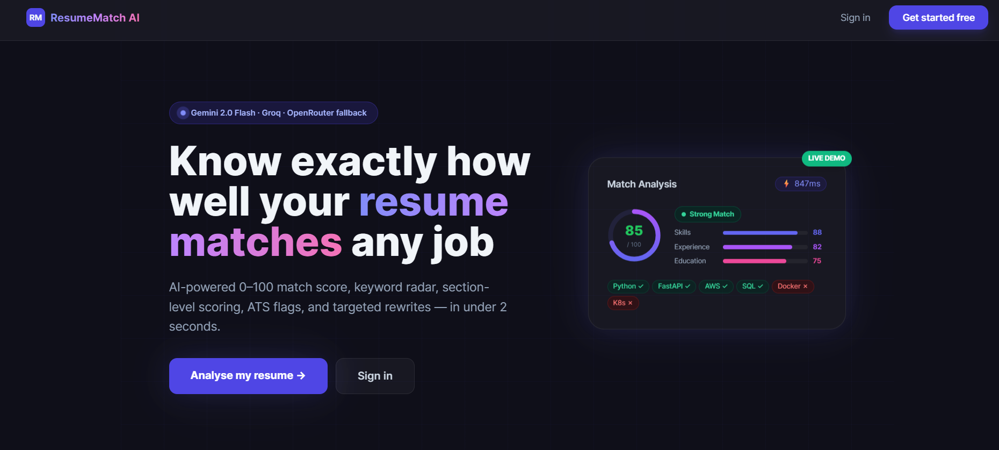
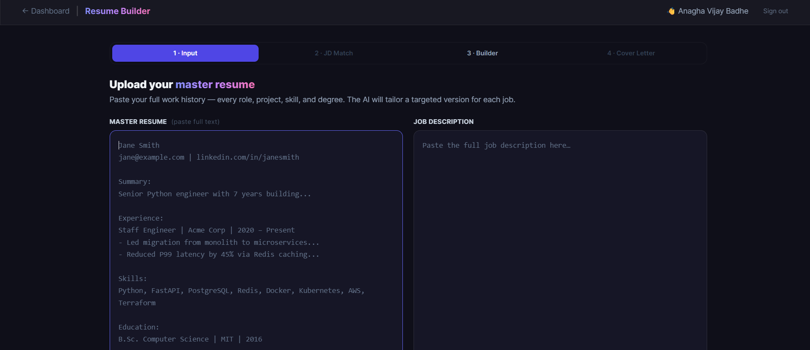
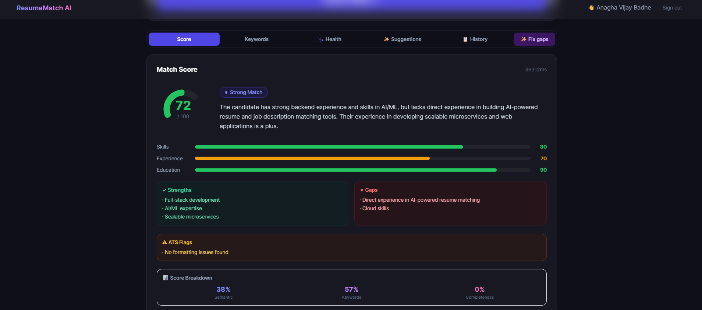
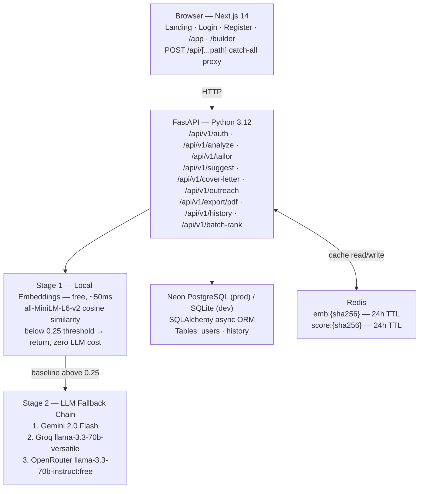
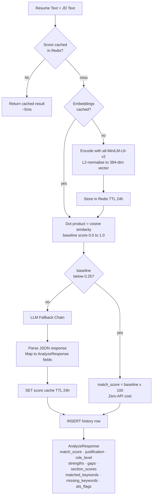
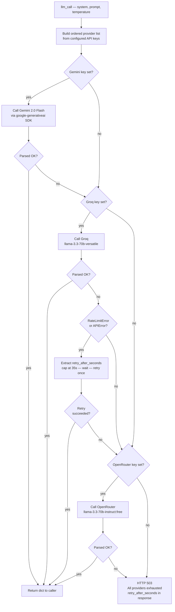

# AI-Powered Resume & JD Matcher

**Live demo: [ai-powered-resume-jd-matcher-nyq5-cyan.vercel.app](https://ai-powered-resume-jd-matcher-nyq5-cyan.vercel.app)**

> Upload a master resume, paste a JD, pick a tailoring depth — get a targeted resume, JD match comparison, AI rewrites, cover letter, outreach message, and a PDF export. Powered by a two-stage pipeline of local embeddings + cascading LLM fallback (Gemini 2.0 Flash → Groq → OpenRouter).

---

## Table of Contents

1. [Features](#features)
2. [Demo Screens](#demo-screens)
3. [System Architecture](#system-architecture)
4. [Technical Decisions](#technical-decisions)
5. [Project Structure](#project-structure)
6. [Quick Start](#quick-start)
7. [Running Tests](#running-tests)
8. [Environment Variables](#environment-variables)
9. [API Reference](#api-reference)
10. [Deployment](#deployment)

---

## Features

| Feature | Description |
|---------|-------------|
| **Resume Scoring** | 0–100 match score, role-level verdict (Perfect/Strong/Partial/Weak), section scores (Skills/Experience/Education) |
| **Score Breakdown** | Semantic similarity %, keyword coverage %, resume completeness % |
| **Resume Health** | Section parser (10 section types), completeness ring gauge, contact extraction, TF-IDF keyword bar chart |
| **JD Match** | Side-by-side comparison with highlighted keywords (✓ found / ✗ missing), match %, covered/missing requirements |
| **Tailoring** | Three depths — Light Nudge, Keyword Enhance, Full Tailor — using Gemini 2.0 Flash |
| **Resume Builder** | Section editor (add/reorder/delete), 4 templates, full formatting controls, live preview |
| **PDF Export** | 4 templates: Swiss Single, Swiss Two Column, Modern, Modern Two Column. Adjustable margins, fonts, spacing, accent colour |
| **Cover Letter** | 3 tones (professional / enthusiastic / concise), subject line, copy-to-clipboard |
| **Outreach Message** | Platform-specific (LinkedIn ≤ 300 chars / Email / Cold Email), live char counter |
| **AI Suggestions** | Section-level rewrites with strikethrough diff, keywords-to-add list, summary rewrite |
| **Keyword Extract** | TF-IDF ranked JD keywords with in_resume flag and importance bars |
| **Batch Ranking** | Score N resumes against one JD, return sorted leaderboard |
| **History** | Per-user analysis history with score, filename, JD snippet, date |
| **Auth** | JWT (HS256, 7-day expiry), bcrypt passwords, register/login/me |
| **Caching** | Redis: embeddings (24h TTL) + LLM responses (24h TTL). Cache hits < 5ms |
| **LLM Fallback** | Gemini → Groq → OpenRouter with retry-after extraction and live countdown on 429 |
| **Two-Stage Pipeline** | MiniLM cosine filter at 0.25 threshold saves ~80% of API quota on low matches |

---

## Demo Screens

| Screen | Screenshot |
|--------|------------|
| Landing page — hero, pipeline diagram, feature cards |  |
| Input tab — resume + JD upload, tailoring depth |  |
| Score tab — radial gauge, verdict badge, section bars |  |
| Resume Analysis — completeness ring, section accordion |  |
| Keywords tab — radar chart + keyword gap pills |  |
| JD Match tab — side-by-side highlighted comparison |  |

---

## System Architecture



---

## Technical Decisions

### Two-Stage Pipeline
MiniLM cosine similarity gates every request. Below 0.25 → return instantly, zero LLM cost. Above → full Gemini analysis. Saves ~80% API quota in practice.



### LLM Fallback Chain with Smart Retry
All three providers (Gemini, Groq, OpenRouter) are tried in order. On 429, `retry_after_seconds` is extracted from the error body, the minimum wait is observed (capped at 35s), then the chain retries once before returning a clean error with a frontend countdown timer.



### TF-IDF Keyword Scoring
Pure Python implementation (no spaCy) — ranks JD keywords by term frequency × IDF-like penalty for terms already in the resume. Highest-scored keywords = most important JD terms you're *missing*.

### Resume Section Parser
Regex heading detector covering 10 section types. Weighted completeness score (experience=30, skills=20, contact=15, education=15, summary=10, …). Contact extraction for email, phone, LinkedIn, GitHub.

### PDF Generation
ReportLab with four templates. Two-column templates use a `Table` flowable to place skills/education in a sidebar. Full formatting controls wired to the frontend builder.

### Database
SQLite for local dev, Neon PostgreSQL for production. One env var swap: `DATABASE_URL=postgresql://...`. asyncpg handles the async driver; `create_all` on startup creates the schema automatically. Connection pool capped at 5 + 2 overflow to stay within Neon free tier limits.

---

## Project Structure

```
AI-Powered-Resume-JD-Matcher/
├── apps/
│   ├── backend/
│   │   ├── app/
│   │   │   ├── models/         analyze, auth, batch, builder, database, history, resume, suggest
│   │   │   ├── routes/         analyze, auth, batch, builder, history, resume, suggest
│   │   │   ├── services/       auth, embedder, llm, parser, pdf_builder, resume_parser, scorer, suggester, tailor
│   │   │   ├── cache.py        Redis async helper + sha256 key builders
│   │   │   ├── config.py       pydantic-settings — all env vars typed
│   │   │   ├── docs.py         OpenAPI metadata
│   │   │   ├── main.py         FastAPI app + lifespan + CORS + router registration
│   │   │   └── worker.py       Celery async batch job definitions
│   │   ├── tests/
│   │   │   ├── conftest.py     Session-scoped DB setup, mock fixtures, shared payloads
│   │   │   └── test_analyze.py 24 tests — health, auth, analyze, resume, suggest,
│   │   │                       tailor, cover letter, outreach, batch, history, PDF
│   │   ├── Dockerfile
│   │   ├── pyproject.toml
│   │   ├── requirements.txt
│   │   └── .env.example
│   │
│   └── frontend/
│       ├── components/
│       │   ├── AuthContext.tsx    JWT auth state
│       │   ├── AuthForm.tsx       Glass card login/register
│       │   ├── CoverLetter.tsx    Cover letter + outreach generator
│       │   ├── JDMatch.tsx        Side-by-side highlighted comparison
│       │   ├── KeywordChart.tsx   Radar chart + keyword pills
│       │   ├── RankingsTable.tsx  Batch rank leaderboard
│       │   ├── ResumeBuilder.tsx  Full section editor + formatting + PDF export
│       │   ├── ResumeHealth.tsx   Completeness ring + section accordion + TF-IDF bars
│       │   ├── ScoreCard.tsx      Radial gauge + section bars + score breakdown
│       │   ├── SuggestionPanel.tsx Diff cards with copy buttons
│       │   └── UploadZone.tsx     react-dropzone PDF/TXT + paste
│       ├── pages/
│       │   ├── api/[...path].ts  Catch-all proxy → FastAPI
│       │   ├── _app.tsx          AuthProvider wrap
│       │   ├── app.tsx           Dashboard (Score/Keywords/Health/Suggestions/History)
│       │   ├── builder.tsx       Builder workflow (Input/JD Match/Builder/Cover Letter)
│       │   ├── index.tsx         Landing page
│       │   ├── login.tsx
│       │   └── register.tsx
│       └── vercel.json
│
├── demo/                         Screenshot assets used in this README
├── render.yaml                   One-click Render deploy blueprint
├── DEPLOYMENT.md                 Full deployment guide
├── README.md
├── .gitignore
├── Resume Matcher.postman_collection.json
└── Resume Matcher.postman_environment.json
```

---

## Quick Start

### Prerequisites

| Tool | Version |
|------|---------|
| Python | 3.12.x |
| uv | latest — `pip install uv` |
| Node.js | 18+ |
| Redis | any — `docker run -d -p 6379:6379 redis:alpine` |

### 1 — Clone

```bash
git clone <your-repo-url>
cd AI-Powered-Resume-JD-Matcher
```

### 2 — Backend

```bash
cd apps/backend
cp .env.example .env
# Edit .env — set GEMINI_API_KEY and SECRET_KEY at minimum
uv sync --dev --no-install-project
uv run uvicorn app.main:app --reload --port 8000
```

- API: http://localhost:8000
- Swagger UI: http://localhost:8000/docs

### 3 — Frontend

```bash
cd apps/frontend
cp .env.local.example .env.local
npm install
npm run dev
```

- App: http://localhost:3000

### 4 — Redis

```bash
docker run -d -p 6379:6379 redis:alpine
```

Redis failures are silent — the app degrades gracefully without caching.

---

## Running Tests

```bash
cd apps/backend
uv run pytest -v
```

24 tests, ~22 seconds. No API keys, Redis, or live database needed — all external calls are mocked.

```
PASSED  test_health
PASSED  test_register_and_login
PASSED  test_login_wrong_password
PASSED  test_me_unauthenticated
PASSED  test_analyze_high_similarity
PASSED  test_analyze_low_similarity
PASSED  test_analyze_cache_hit
PASSED  test_analyze_requires_auth
PASSED  test_resume_parse
PASSED  test_resume_parse_tfidf_keywords
PASSED  test_keyword_extract
PASSED  test_suggest
PASSED  test_tailor_keywords_depth
PASSED  test_tailor_all_depths
PASSED  test_tailor_invalid_depth
PASSED  test_cover_letter
PASSED  test_cover_letter_all_tones
PASSED  test_outreach_linkedin
PASSED  test_outreach_all_platforms
PASSED  test_batch_rank
PASSED  test_history_returns_list
PASSED  test_history_limit_param
PASSED  test_history_invalid_limit
PASSED  test_pdf_export_all_templates
```

---

## Environment Variables

### Backend (`apps/backend/.env`)

| Variable | Required | Default | Description |
|----------|----------|---------|-------------|
| `SECRET_KEY` | **Yes** | — | JWT signing key, min 32 chars. Generate: `python -c "import secrets; print(secrets.token_hex(32))"` |
| `GEMINI_API_KEY` | **Yes** | — | Primary LLM. Free at [aistudio.google.com](https://aistudio.google.com/app/apikey) |
| `GROQ_API_KEY` | No | — | First fallback. Free at [console.groq.com](https://console.groq.com) |
| `OPENROUTER_API_KEY` | No | — | Second fallback. Free at [openrouter.ai](https://openrouter.ai) |
| `REDIS_URL` | **Yes** | `redis://localhost:6379` | Redis connection string |
| `DATABASE_URL` | **Yes** | `sqlite+aiosqlite:///./resume_matcher.db` | SQLite for dev, Neon PostgreSQL URL for prod |
| `GEMINI_MODEL` | No | `gemini-2.0-flash` | |
| `GROQ_MODEL` | No | `llama-3.3-70b-versatile` | |
| `OPENROUTER_MODEL` | No | `meta-llama/llama-3.3-70b-instruct:free` | |
| `LOW_SIMILARITY_THRESHOLD` | No | `0.25` | Cosine score below which LLM is skipped |
| `CACHE_TTL` | No | `86400` | Cache TTL in seconds (24h) |

### Frontend (`apps/frontend/.env.local`)

| Variable | Required | Description |
|----------|----------|-------------|
| `NEXT_PUBLIC_API_URL` | **Yes** | Backend base URL e.g. `http://localhost:8000` |

---

## API Reference

All routes prefixed `/api/v1/`.

| Docs | URL |
|------|-----|
| Swagger UI (local) | [localhost:8000/docs](http://localhost:8000/docs) |
| ReDoc (local) | [localhost:8000/redoc](http://localhost:8000/redoc) |
| Swagger UI (prod) | [resume-matcher-api.onrender.com/docs](https://resume-matcher-api.onrender.com/docs) |
| ReDoc (prod) | [resume-matcher-api.onrender.com/redoc](https://resume-matcher-api.onrender.com/redoc) |

| Method | Path | Auth | Description |
|--------|------|------|-------------|
| `POST` | `/auth/register` | — | Register → JWT |
| `POST` | `/auth/login` | — | Login → JWT |
| `GET` | `/auth/me` | Bearer | Current user profile |
| `POST` | `/analyze` | Bearer | Score resume vs JD (text) |
| `POST` | `/analyze/upload` | Bearer | Score resume vs JD (PDF/TXT) |
| `POST` | `/resume/parse` | Bearer | Parse sections + TF-IDF keywords |
| `POST` | `/keywords/extract` | Bearer | Rank keywords by TF-IDF |
| `POST` | `/suggest` | Bearer | AI bullet rewrites |
| `POST` | `/tailor` | Bearer | Tailor master resume to JD (3 depths) |
| `POST` | `/cover-letter` | Bearer | Generate cover letter (3 tones) |
| `POST` | `/outreach` | Bearer | Generate outreach (3 platforms) |
| `POST` | `/export/pdf` | Bearer | Export resume to PDF (4 templates) |
| `GET` | `/history` | Bearer | User's past analyses |
| `POST` | `/batch-rank` | Bearer | Rank N resumes vs 1 JD |
| `GET` | `/health` | — | Liveness probe |

A Postman collection and environment are included at the project root (`Resume Matcher.postman_collection.json` / `Resume Matcher.postman_environment.json`). The environment has both `{{baseUrl}}` (localhost) and `{{prodBaseUrl}}` (Render) — swap the variable in a request to test against production.

---

## Deployment

Deployed on **Render** (backend) + **Vercel** (frontend) on free tiers. Database hosted on **Neon** (free tier PostgreSQL).

| Service | URL |
|---------|-----|
| Frontend | [ai-powered-resume-jd-matcher-nyq5-cyan.vercel.app](https://ai-powered-resume-jd-matcher-nyq5-cyan.vercel.app) |
| Backend API | `https://resume-matcher-api.onrender.com` |
| Swagger UI | `https://resume-matcher-api.onrender.com/docs` |
| Health check | `https://resume-matcher-api.onrender.com/health` |

See **[DEPLOYMENT.md](DEPLOYMENT.md)** for:
- Docker / Docker Compose setup
- Render one-click blueprint (`render.yaml`)
- Neon PostgreSQL setup
- Getting free API keys (Gemini / Groq / OpenRouter)
- Troubleshooting guide

### Stack

| Layer | Technology |
|-------|-----------|
| Frontend | Next.js 14, React 18, Tailwind CSS, Recharts |
| Backend | FastAPI, Python 3.12, SQLAlchemy async ORM |
| Embeddings | sentence-transformers `all-MiniLM-L6-v2`, PyTorch CPU |
| LLMs | Gemini 2.0 Flash → Groq llama-3.3-70b → OpenRouter llama-3.3-70b |
| Database | Neon PostgreSQL (prod) / SQLite (dev) |
| Cache | Redis (Render managed) |
| PDF | ReportLab |
| Auth | python-jose JWT + passlib bcrypt |
| Deploy | Render (backend + Redis) + Vercel (frontend) + Neon (DB) |
